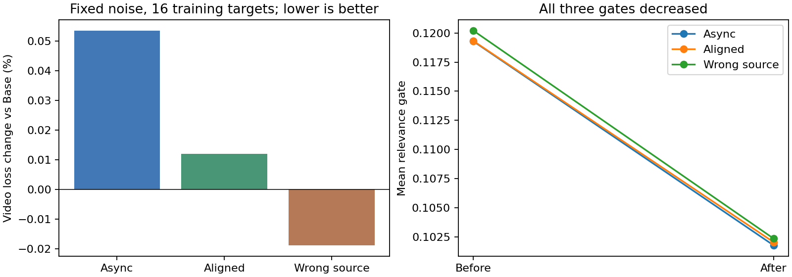
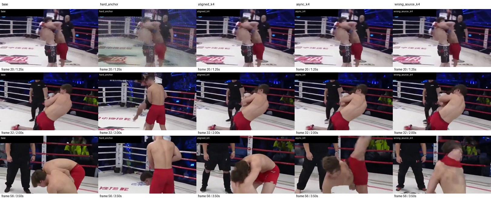

# R0 修补与短实验（2026-09-09）

**两步真实优化器检查与单卡 10-step 诊断已完成。学习路径可用，但尚未看到正确参考优于 wrong-source 的证据，因此不扩大到 50/200-step。** 这不是对异步世界记忆或长期抗漂移假设的否定：当前仍是 clean GT prefix、同视频过去帧的短窗口 proxy。

## 本轮修补

- 新增有效 memory token 数与 `H / log(N_valid)`；N=0/1 时定义为 0。训练、固定噪声探针、AR 评估都记录原始和归一化 entropy。
- 训练日志记录 output/projector/query/key/value/gate 的独立梯度范数、video loss、正确／wrong-source gate、sample ID、数据等待和计算耗时。
- 新指标和变体名称使用 `wrong_source`，保留原有 manifest 中 `wrong` 的兼容标签。不同 source 不等于无关 world，不把这些样本称为已认证的 wrong-world negatives。
- 修复原方案的 `alpha/boxed/frac/text/times/top/rightarrow/not` 转义损坏，清除非预期控制字符。
- 澄清状态：R0 heuristic shot-cut 过滤已完成；人工审核未完成；旧 ReAnchor manifest 未重新清洗。
- 目标视频解码增加 backward keyframe seek，仍按原始绝对时间采样。8 个真实窗口（target_start 2.2–100.6 秒）逐像素与顺序解码完全相同。100.6 秒窗口本次耗时从 3.63 秒降至 0.50 秒；旧实现先运行，这不是随机化性能基准。
- 23 项 CPU 单元／接口测试通过，覆盖有效 token entropy 和目标 seek 的回归。

## 两步真实优化器检查

脚本：[check_reality_optimizer.py](scripts/check_reality_optimizer.py)。用同一个真实 async 样本、相同噪声种子 123，关闭 dropout 和所有正则，只检查 video-loss 的梯度路径。使用真实冻结 LongLive / 官方 LoRA，AdamW LR=1e-4，执行两次更新后丢弃该模型，单卡 overfit 重新初始化。

| 梯度组 | 第一步 | 第二步 |
|---|---:|---:|
| Output | 0.911731 | 0.515929 |
| Projector | 0 | 0.00286447 |
| Query | 0 | 0.00166508 |
| Key | 0 | 0.00009915 |
| Value | 0 | 0.00146572 |
| Gate | 0 | 0.00094397 |

同噪声 video loss：`0.32075986 → 0.31351566`。两次更新后 No Memory context 都严格等于 Base；冻结主干梯度全为 None。报告：[optimizer_sanity.json](validation/reality_memory/overfit_review/optimizer_sanity.json)。

## 单卡 10-step 诊断

从 16 个固定、四类各 4 个的样本池开始，按原 seed 42 的 DistributedSampler 顺序抽取 10 个 batch。实际见到：Async 2、Aligned 1、No Memory 4、Wrong Source 3。四个空记忆 batch 的梯度为零，跳过 AdamW／weight decay；因此 **10 个 batch step、6 次 optimizer 更新**，不是 10 次有效更新，也还没有在样本池上反复过拟合。

使用原 YAML：per-reference dropout 0.2、LR 1e-4、10 次更新 warmup、delta 正则 1e-5、wrong-source gate 正则 0.01。没有改变模型架构、数据划分或 57×256×432／16 FPS 的窗口。每次活跃更新均有有限梯度，主干无梯度。checkpoint 保存在本机 `checkpoints/reality_memory_overfit_review/step_0010`。

训练前后，对全部 16 个训练目标分别使用 K=2 的 Async／Aligned／Wrong Source 参考、同一噪声和同一目标，关闭 dropout 与正则测量 video loss。Base 与 No Memory 在前后均为 `0.21380087`。

| 参考 | 训练前 video loss | 训练后 video loss | 相对 Base 变化 | Gate 前 → 后 |
|---|---:|---:|---:|---:|
| Async | 0.21380087 | 0.21391549 | +0.0536% | 0.119293 → 0.101776 |
| Aligned | 0.21380087 | 0.21382640 | +0.0119% | 0.119324 → 0.102051 |
| Wrong Source | 0.21380087 | 0.21376046 | −0.0189% | 0.120209 → 0.102356 |

误差越低越好。三类 gate 一起降低，wrong-source 并没有比 correct 更低；归一化 entropy 均约 0.9997，attention 仍接近均匀。Async 优于 Base 的目标为 7/16；Wrong Source 为 9/16，差异很小，不能作为正向效果。



单个固定验证目标的 AR rollout（K=4）也已完成，每个变体使用相同 prefix、prompt、噪声并重建缓存：

| 变体 | 完整 future latent MSE |
|---|---:|
| Base / No Memory | 0.82314020 |
| Hard Anchor | 0.81149232 |
| Aligned Soft | 0.79545331 |
| Async Soft | 0.83946258 |
| Wrong Source | 0.80078071 |
| Shuffled Source | 0.78622282 |

No Memory 的整段 latent 与 Base 完全相同。Oracle GT State 在当前干净 prefix 上等于 Base，旧的受损历史 Oracle 诊断保持独立。只有 1 个验证样本，不能推断一般性能；未计算 DINO copy 或 LPIPS。8 个 MP4 已检查为 57 帧、16 FPS，位于本机 `outputs/reality_memory/reality_memory_overfit_review/step_10/rank_0/case_000`。



该样本的 Hard Anchor 在替换处可见重编码伪影；Soft Memory 没有替换该帧。后续各变体轨迹都发生分歧，这张图不证明某一变体的整体视频质量更好。

训练 batch 总耗时约 20.76 秒，中位数 1.70 秒，数据等待占 7.26%，峰值显存约 41.92 GiB。1 Hz GPU trace 的全进程平均利用率约 52.3%；它包含模型加载、前后探针和 AR 评估，不能当作训练阶段单独的利用率。

完整记录：[summary.json](validation/reality_memory/overfit_review/summary.json)、[逐步日志](validation/reality_memory/overfit_review/train_steps.jsonl)、[训练前](validation/reality_memory/overfit_review/probe_before.json)、[训练后](validation/reality_memory/overfit_review/probe_after.json)、[AR 指标](validation/reality_memory/overfit_review/ar_validation.json)。

## 四卡 NCCL 保存／恢复 smoke

在决定不扩大效果实验后，仍完成了一个独立的工程 smoke：4×A800、NCCL、固定 16 样本、跳过 AR evaluation，先运行 3 个全局 batch step，结束进程，再从 `step_0003/state.pt` 重新启动并完成第 4 步。结果：[nccl_resume.json](validation/reality_memory/overfit_review/nccl_resume.json)。

`optimizer_steps` 从 3 增至 4，4 个 rank 都恢复了 RNG；第 1–4 步每个 rank 的 all-reduce 后分组梯度范数逐步一致，续训后所有 memory 参数张量均发生有限更新。该检查确认了真实 NCCL、optimizer state、checkpoint 和 restart/resume 链路；不等价于与不中断训练的 bitwise 对照，也不构成效果实验。kernel autotune 的 shared-memory 警告已自动选择可用配置，训练成功完成。

## 复现命令

```bash
cd /workspace/video-model/restream_mvp
CUDA_VISIBLE_DEVICES=0 OMP_NUM_THREADS=8 \
  .venv/bin/python scripts/check_reality_optimizer.py --reviewed
CUDA_VISIBLE_DEVICES=1 OMP_NUM_THREADS=4 \
  .venv/bin/python scripts/cache_reality_features.py --overfit-samples 16
CUDA_VISIBLE_DEVICES=0 RESTREAM_WORLD_SIZE=1 \
  bash scripts/train_reality_memory.sh --reviewed --max-steps 10 \
  --overfit-samples 16 --probe-overfit --output checkpoints/reality_memory_overfit_review
.venv/bin/python scripts/summarize_reality_overfit.py
```

现有输出目录需使用新目录复现实验，不能无意覆盖已有 checkpoint。探针额外缓存了 326 个训练对照参考，不改变原始训练行或数据划分。

## 研究判断

本轮证明了零初始化后第二步的真实学习路径、空记忆不变性、单卡短训练和四卡 NCCL 保存／恢复链路。尚未证明 use/ignore 的有效区分，暂不进行四卡 50/200-step 效果实验。

下一轮应先设计重复固定小样本的配对实验，明确有效 optimizer 更新数，并比较 correct/wrong-source 在同一目标上的差异。clean GT prefix 的参考冗余、wrong-source 可能仍有相关先验、同视频过去帧只是 proxy，都限制了当前结果；长期抗漂移仍需 degraded-history／self-rollout 与不同时间／视角的同世界数据。
